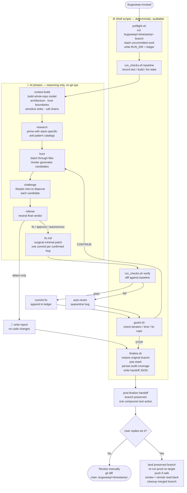
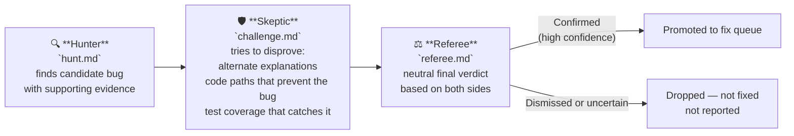
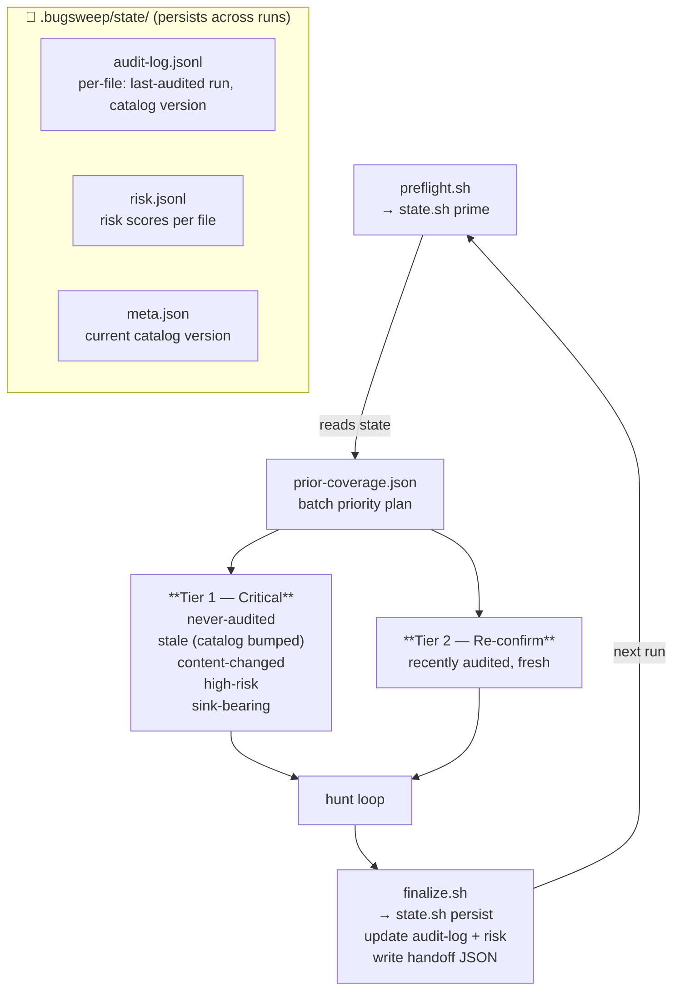

# bugsweep — AI bug hunting & auto-fix for your codebase

[](https://github.com/shanemhamilton/bugsweep/releases)
[](LICENSE)
[](https://claude.ai/code)
[](https://github.com/openai/codex)
[](#configure)

> **An autonomous, adversarial AI code-review and bug-fixing skill for [Claude Code](https://claude.ai/code) and [Codex](https://github.com/openai/codex).** It finds real security vulnerabilities, logic errors, race conditions, and data-integrity bugs across your whole repository — then, when you let it, fixes them on a throwaway git branch you fully control. Safe enough to run unattended overnight.

A Claude Code and Codex skill that finds and fixes bugs in your codebase — safely enough
to run unattended, even fully autonomously overnight. It hunts for real runtime bugs
(security holes, logic errors, race conditions, bad error handling, data-integrity
issues), and when you let it, fixes them on a throwaway branch with automatic revert if a
fix breaks anything.

It does four things that make it effective on real, large codebases:
- **Whole-repo context.** Before hunting, it builds a distilled model of your
  architecture — trust boundaries, sensitive sinks, and the call chains into them — so it
  catches *large* cross-file bugs (like a missing authorization check on one path into a
  database write), not just local ones.
- **Stack-aware research.** It detects your languages/frameworks and primes itself with a
  curated library of the bugs common to that kind of code (with optional, off-by-default
  web research for version-specific advisories).
- **Adversarial review.** Every finding runs a gauntlet — a Hunter finds it, a Skeptic
  tries to disprove it, and a neutral Referee makes the final call — so false positives
  rarely reach the fix stage.
- **Context continuity.** All progress is written to disk, so on a long run it can reset
  its working memory and keep going without losing findings, fixes, or coverage.

## The one thing to understand

**The worst case for any core run is a branch you delete.** bugsweep never works on your
real branch during the hunt/fix loop, never pushes anywhere, never merges, and never
deletes files. It cuts a fresh `bugsweep/<timestamp>` branch, makes its fixes there as one
commit each, and re-runs your tests after every fix — automatically undoing any fix that
breaks something. You review the branch and decide what to keep. You are always the merge
gate.

The dangerous, irreversible operations (branching, stashing your work, reverting) are
done by short shell scripts in `scripts/` that you can read in a few minutes — not by the
AI's judgment. That's what makes it trustworthy for long unattended runs.

## How it works

### Full run pipeline



### Adversarial review — why bugsweep has a low false-positive rate

Every candidate finding runs a three-role gauntlet before it can be fixed or reported. The model never evaluates its own findings.



### Coverage-first state — how bugsweep finds bugs in old, unchanged code

bugsweep is not a diff scanner. Every file in the repo is always in scope. Cross-run state lets it track which files have been reviewed at the current catalog version and prioritize the ones that haven't.



## Install

**One command — works for Claude Code, Codex, or both:**

```bash
curl -fsSL https://raw.githubusercontent.com/shanemhamilton/bugsweep/main/install.sh | bash
```

The script auto-detects which AI tools you have installed (`~/.claude` → Claude Code,
`~/.codex` → Codex) and sets up each one. Re-running it updates in place.

**Force a specific tool:**

```bash
# Claude Code only
curl -fsSL https://raw.githubusercontent.com/shanemhamilton/bugsweep/main/install.sh | bash -s -- --claude

# Codex only
curl -fsSL https://raw.githubusercontent.com/shanemhamilton/bugsweep/main/install.sh | bash -s -- --codex

# Both
curl -fsSL https://raw.githubusercontent.com/shanemhamilton/bugsweep/main/install.sh | bash -s -- --all
```

**Pin to a specific release** (instead of tracking the latest `main`):

```bash
curl -fsSL https://raw.githubusercontent.com/shanemhamilton/bugsweep/main/install.sh | bash -s -- --version v0.1.0
```

Re-running the installer with `--version` checks out that release tag; re-running without
it returns you to the latest `main`. See [releases](https://github.com/shanemhamilton/bugsweep/releases)
and the [CHANGELOG](CHANGELOG.md).

**Manual install (if you prefer to inspect first):**

```bash
git clone https://github.com/shanemhamilton/bugsweep.git
bash bugsweep/install.sh          # then delete the clone — it installs to ~/.claude or ~/.codex
```

**What the installer does:**
- *Claude Code* — clones to `~/.claude/skills/bugsweep/`. Claude Code auto-discovers skills
  there; no config needed.
- *Codex* — clones to `~/.codex/skills/bugsweep/` and appends a stub to
  `~/.codex/instructions.md` so Codex knows where the scripts live.

## Use

Open Claude Code (or start Codex) in your project and type one of:

| Command | What it does |
| --- | --- |
| `/bugsweep` | Find bugs and write a report. **Makes no changes.** Start here. |
| `/bugsweep --approve` | Find + fix, but asks you before each fix. Use this to build trust. |
| `/bugsweep --autonomous` | Find + fix in a loop until clean or a limit is hit. The overnight mode. |
| `/bugsweep src/api` | Limit the sweep to a folder or file. |
| `/bugsweep --severity high` | Only fix high/critical bugs; report the rest. |

Recommended path: run `/bugsweep` once to see what it finds, then `/bugsweep --approve`
to watch how it fixes, then `/bugsweep --autonomous` once you trust it.

## After a run

It tells you the branch name and how to review:

```
git diff <your-branch>..bugsweep/<timestamp>
```

It also writes `<RUN_DIR>/post-finalize-handoff.json`, a machine-readable handoff with the
preserved branch, report path, fix commits, quality gate, smoke checks, push policy,
cleanup policy, deletion proof, and final read-back commands.

For `/bugsweep --autonomous`, the recommended next step is intentionally one compound
approval:

> Reply `do it` to land the preserved branch, re-run proof on the target branch, push if
> safe, run configured smoke checks, verify remote read-back, and delete the now-merged
> bugsweep branch.

That does not weaken the trust contract. The core run still stops at finalize and leaves
the fixes stranded on `bugsweep/<timestamp>` until you approve the continuation. The
approved follow-through uses the handoff JSON and the optional cleanup script so a parent
agent does not need to ask again after the merge.

Branch deletion is allowed only after proof that the branch is contained in the target
branch (`git merge-base --is-ancestor <branch> <target>`). If the branch is checked out in
a linked worktree, cleanup removes that worktree only when it is clean: no unstaged
changes, no staged changes, and no untracked files. Dirty worktrees and unmerged branches
are preserved.

Manual review still works the same way: keep what you like with a cherry-pick or merge, or
discard explicitly if you decide the branch is not worth keeping. Your original branch and
uncommitted work are exactly as you left them.

### Repeatable, unattended runs

Running bugsweep on a schedule makes it dig deeper over time on its own — coverage-first
cross-run state means each run prioritizes the files it hasn't audited yet. The only thing
that accumulates is one `bugsweep/<timestamp>` branch per run, because bugsweep never merges
or deletes (you're the merge gate). To keep scheduled runs ending clean, the optional
companion script `scripts/bugsweep-cleanup.sh` automates that gate *after* finalize and
after approval: it merges the verified fix branch into a branch you choose, deletes only
branches proven contained in that target, and preserves dirty worktrees or unmerged
branches — using only plain git, outside the core hunt/fix loop. See
[`references/autonomous-maintenance.md`](references/autonomous-maintenance.md) for the
copy-paste prompt, settings, and scheduling notes.

## Configure

Edit `config/bugsweep.config.json` to set limits (how long it runs, how many fixes),
exclude folders, or specify your test/build commands if auto-detect misses them. See
`references/tuning.md`.

## FAQ

**How is bugsweep different from Snyk, CodeQL, SonarQube, or Dependabot?**
Those are mostly pattern/diff scanners and dependency auditors. bugsweep is an *agentic*
reviewer: it builds a whole-repo architecture model and reasons about behavior, so it
catches cross-file logic bugs (like a missing authorization check on one path into a
database write) that pattern matchers miss. It complements those tools rather than
replacing them — and it can fix what it finds, not just flag it.

**What languages and frameworks does it support?**
Any language Claude Code or Codex can read. It ships curated anti-pattern catalogs for
common stacks (JavaScript/TypeScript, Python, Go, Rust, Swift/iOS, and more) and detects
your stack automatically to prime the hunt.

**Is it safe to run on a production codebase?**
Yes — that's the design center. bugsweep never works on your branch, never pushes, never
merges, and never deletes files. It cuts a throwaway `bugsweep/<timestamp>` branch, and
the irreversible git operations are short shell scripts you can audit in minutes. The
worst case for any run is a branch you delete.

**Does bugsweep send my code anywhere?**
No third-party services, no telemetry, and no network calls — unless you explicitly opt
into bounded web research for version-specific advisories (off by default). Your code
goes only to the AI tool you already use.

**Can it run unattended or in CI?**
Yes. `/bugsweep --autonomous` runs a find-and-fix loop until the codebase is clean or a
configured limit (time, iterations, or fix count) is hit, re-running your tests after
every fix. State persists to disk so long runs survive context resets. Landing, pushing,
smoke checks, remote read-back, and branch cleanup happen through the explicit
post-finalize continuation so the merge gate stays visible.

**Does it work with OpenAI Codex too, or just Claude Code?**
Both. The installer sets up whichever you have (`--claude`, `--codex`, or `--all`).

## What's inside

- `SKILL.md` — the instructions Claude follows.
- `scripts/` — the deterministic safety + state layer: `preflight` (branch/stash setup),
  `run_checks` (tests/build), `guard` (stop conditions), `session` (continuity anchor),
  `finalize` (safe return plus `post-finalize-handoff.json`). Plus two *optional*,
  user-owned companions for scheduled runs (outside the core hunt/fix loop):
  `bugsweep-prepare.sh` (if the tree is dirty, it defers to an active session or commits
  genuinely idle work to close the tree — never parks, never discards) and
  `bugsweep-cleanup.sh` (the post-run merge gate; the only script that merges or deletes,
  and only when you choose to run it).
- `prompts/` — the phases, kept separate so the AI never rubber-stamps its own findings:
  `context-build` (whole-repo model), `research` (anti-pattern priming), `hunt` (local +
  architectural lenses), `challenge` (Skeptic), `referee` (final arbiter), `fix`.
- `references/` — safety rationale, the no-tests playbook, tuning notes, the
  context/continuity model, and `antipatterns/` (the curated per-stack catalogs).
- `config/bugsweep.config.json` — your settings (caps, excludes, commands, and the
  adversarial / research / session toggles).

No third-party dependencies, no network calls (unless you opt into web research), no
telemetry. Read `scripts/` and `references/safety-rationale.md` before trusting it — that's
the whole point of owning it.
